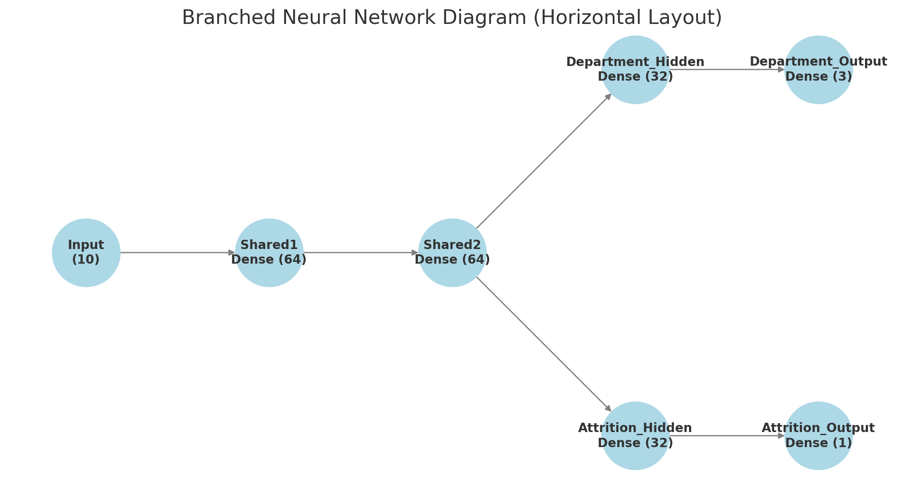

# Employee Attrition & Department Prediction: Convolutional Branching Neural Network

## Summary

This repository hosts a Jupyter Notebook showcasing a branched neural network model designed to assist HR in two predictive tasks:

1. **Employee Attrition Prediction**: Predicting whether employees are likely to leave the company.
2. **Department Recommendation**: Identifying the department where an employee may be better suited.

---

## Branched Neural Network Diagram


---

## Setup

The Jupyter Notebook for this project is named `attrition.ipynb`. Ensure you have the required dependencies installed before proceeding.

### Requirements

1. Python v3.10 or later
2. Jupyter Notebook
3. Visual Studio Code or any other preferred IDE

---

## Installation Steps

1. Clone this repository to your local machine:
   ```bash
   git clone git@github.com:tlockhart/neural-network-challenge-2.git
2. Open Visual Studio Code
3. Open the `attrition.ipynb` jupyter notebook.
4. Select Run All
5. Select Python 3.10.4.1, if prompted for kernel
